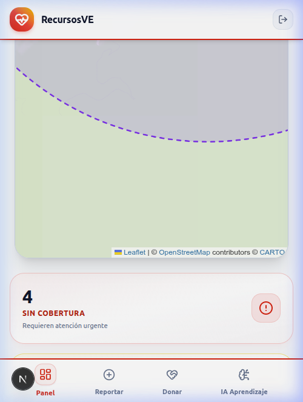
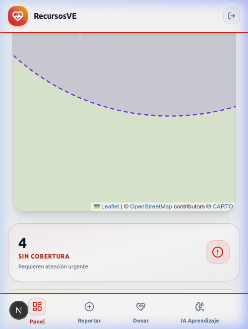
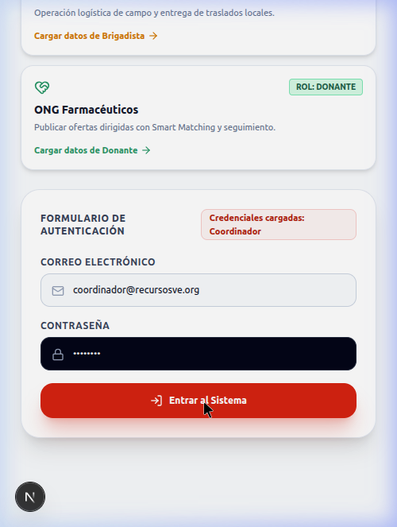

# 📐 Documentación Visual y Diagramas de Arquitectura — RecursosVE

Este directorio contiene los diagramas conceptuales, de flujo de datos y wireframes del sistema **RecursosVE**.

---

### 1. Sistema Multiagente (Estructura General)

* **Descripción**: Representa la arquitectura global del sistema con los 5 agentes especializados (Captura, Analizador, Coordinador Operativo, Evaluador y Aprendizaje) conectados a la Memoria Persistente y gestionando Inputs (Necesidades, Inventario, Donaciones, Estado de rutas) y Outputs (Redistribución, Donaciones dirigidas, Alertas).

---

### 2. Ciclo de Mejora Continua

* **Descripción**: Muestra la economía circular de información en 6 fases: Observación ➔ Análisis ➔ Coordinación Operativa ➔ Acción ➔ Evaluación ➔ Aprendizaje.

---

### 3. Flujo de Comunicación y Procesamiento de Eventos

* **Descripción**: Diagrama de secuencia desde la generación del Reporte Offline en campo hasta la Confirmación de Entrega y el Feedback Loop hacia el Agente Evaluador.

---

### 4. Arquitectura Basada en Eventos (Event Bus)

* **Descripción**: Topología de publicación y suscripción a través del Bus de Eventos (Kafka / RabbitMQ) entre los 5 agentes del sistema.

---

### 5. Wireframe del Panel del Brigadista

* **Descripción**: Diseño de interfaz móvil para brigadistas en campo con Manifiesto de Carga, alerta de vías bloqueadas y tiempos de llegada estimados (ETA).
